# 碎碎念

2023赛季开源的超级电容控制板，是对学长留下来的版本进行了PCB的重新绘制、小量修改（甚至加了一些没用的设计），还有代码的完善（代码我自己改的都看不下去了）。而在今年的超级电容控制板的设计中，我重新审视了超级电容模块的需求，结合超级电容组的测试数据，经历一年的学习（好像也没学会什么），我对超级电容控制器有了更深的理解。在保留功率拓扑不变的情况下，对外围芯片重新选型，以较低的成本（其实还能更低）实现设计的参数，同时也尽量缩小了体积。
本文只会对文章中出现的芯片电路的选型以及设计进行说明，不涉及电路原理的讲解。

> 全文篇幅较长，我较为详尽地讲述了本设计的选型与设计思路。
> 但我个人能力有限，不能保证内容完全正确，若发现错误还请指正。希望本文内容对你有所帮助。

# 简介

此版本取名为Lite，旨在保留功能完整性的其前提下，尽量精简外围电路的设计，希望以较小的成本和体积，实现较高的性能。
以下是本项目所使用的一些主要芯片：

- 主控：STM32G431CBT6
- 栅极驱动：EG2181
- 半桥MOS：WSD40120DN56G
- 关断PMOS：WSD40L60DN56
- 电感：106-125磁环22uH
- 母线电流采样：INA139
- 电容电流采样：INA181A2（冗余不足，存在风险）
- 辅助电源：JW5026；RT9193

本项目设计之初就没有过多考虑纯硬件的保护电路，只在母线上添加了TVS以减少浪涌电压的危害，以及半桥附近添加热敏电阻以进行温度监控。更多的保护措施是由软件进行的，软件的保护措施将在「控制与逻辑篇」进行说明。

> 其实后来想想，加一个一次性保险丝会更加安全。

在电路板中还添加了半桥部分的关键测试点。此外还有一个复位开关（可以复用成按键）与一个拨码开关，两个LED指示灯，这些都是为了更加方便地进行调试。

> 本项目使用Kicad8.0进行设计。

# 电路设计

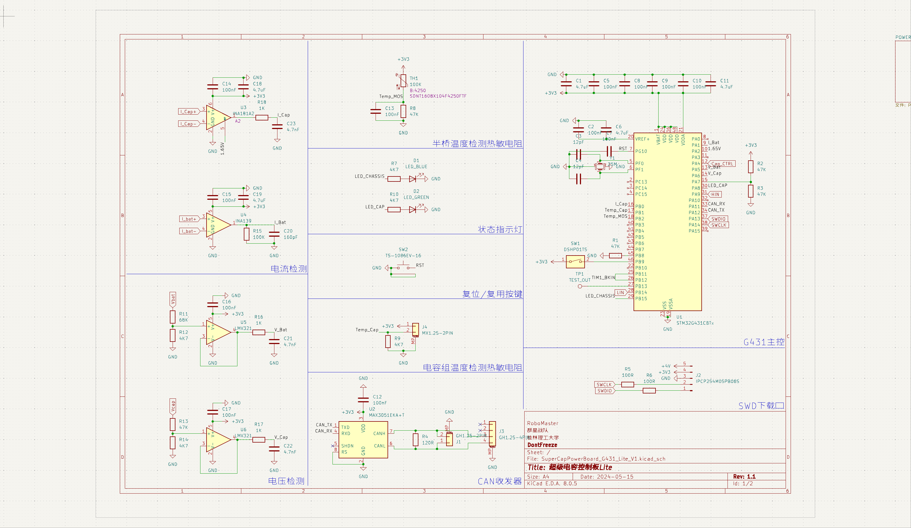

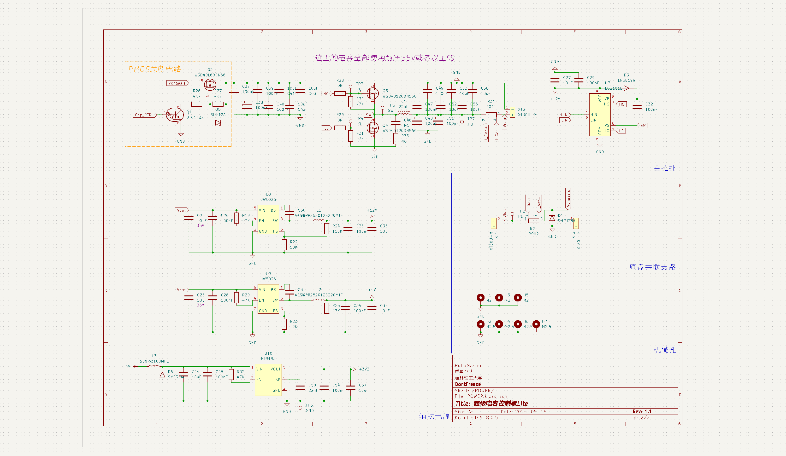

## 主控

主控选用STM32G431CBT6，是因为上一代所使用的STM32F334性能较低，而同一系列的G474虽然拥有HRTIM，但是我觉得对于我100Khz的开关频率来说用不上。另一个比较重要的原因是，STM32G431CBT6在优信有现货，且价格为9.3元/片，F334全型号优信均无上架，G474RBT价格还算便宜，但是封装面积增大，不利于缩小体积，并且高端型号有更高的涨价风险。G431CBU6虽然更加便宜，但是其QFN封装对电烙铁不友好，焊接难度更大，不考虑。

对于定时器PWM分辨率的考虑，STM32G4系列新增了PWM输出的“抖动模式”（在《RM0440参考手册》1130页有相关描述），这一功能使得PWM的分辨率提高到了最高20位，在100Khz下可以拥有27200的计数值可用于占空比更改（未开启抖动模式仅为1700计数值）。

> 有一种说法是PWM的分辨率要比ADC的分辨率高，才能保证电源输出的稳定（这是我听学长说的，没有找到相关资料）。

一开始其实还考虑到G431内置三个运算放大器可用于作为电压采样的跟随器使用，但是在1.0的硬件版本的测试中发现，内置的运算放大器线性度较差，对采样数据会产生较大的影响（非常奇怪，我用F3的运算放大器的时候都没出现这种情况）。最后只将运算放大器用于INA181的检流偏置电压的阻抗变换（因为这是一个固定的电压，不会产生影响）。

G4系列单片机还有一个比较方便的功能，内置可调参考电压，参考电压为2.048V、2.5V、2.9V。此功能可以减少LDO电压精度的影响，提高ADC的测量精度。

> 本项目使用STM32G4内部的2.5V基准作为参考电压。

## 栅极驱动器

栅极驱动器使用IR2181或者EG2181都可，英飞凌原版的价格会更高，也容易买到假货，屹晶微电子国产会更便宜，目前还没用出什么毛病。这个驱动是外置的自举二极管，内置自举二极管的驱动通常都比较昂贵。

这个驱动器2A推拉电流我感觉还是有点高（选的时候没觉得，使用过后才觉得），1A推拉对于本项目100Khz开关频率应该是足够了。在栅极驱动器的手册中，有驱动输出的上升/下降时间的参数，或许可以认为这是栅极驱动器的极限速度，就算MOS的参数再好，这个速度可能也不会有太明显的改善（这是我自己的理解，没有进行实际测试）。EG2181的典型上升/下降时间为100ns，在100Khz的开关频率下，开关周期为10us，而上升+下降时间大约为200ns，占一个周期的1/50，我认为这是一个不错的参数。（没有什么依据，不过越快损耗越小，当然EMI也会更明显）

这个栅极驱动器是高低边驱动信号分离的，这有利于数字控制死区，能够进一步优化死区，减小损耗。比较推荐这种形式的栅极驱动器，固定死区或者是电阻调节死区的就不够方便（虽然说调好之后一般不会变）。
半桥开关管

半桥开关管选用WSD40120DN56，这个管子是照着CSD18540（拆机三毛钱神管）去选择的，价格不算太贵，性能也足够（主要这MOS是白嫖的样片，真香）。

MOS的选型要考虑栅极驱动的驱动能力，能否在设计的开关频率下将MOS在合理的时间内进行导通与关断至关重要。对于MOS导通上升时间的计算，书本上的公式非常详细但是又很繁杂，当然这是为了能够尽量得到准确的数值用于计算MOS在导通过程中产生的损耗。为了能够快速精简地进行选型，在这里我参考了MicroChip的《AN799：MOSFET驱动器与MOSFET的匹配设计》进行计算。

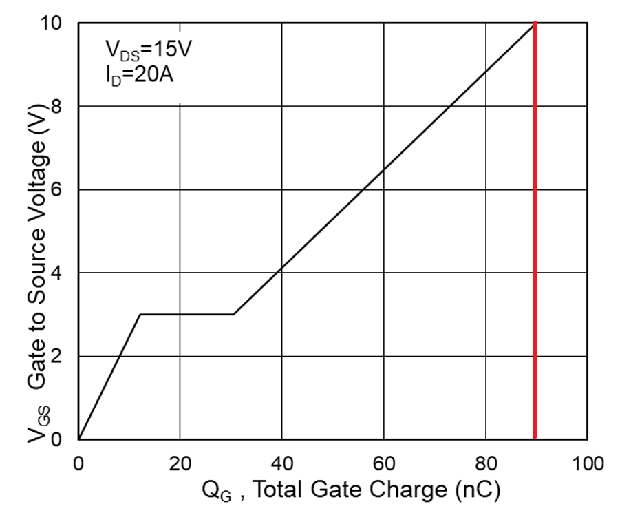

驱动电压是10V，MOS的Qg是90nc（根据Vgs-Qg图表得出），期望上升时间是100ns，计算得出峰值驱动电流：90nc / 100ns = 0.9A，粗略考虑寄生参数的影响，我认为将此参数乘1.3~1.5较为稳妥，可得出最小推拉电流1.3A左右的栅极驱动可以将90nc的MOS以100ns左右的上升时间进行导通。

根据栅极驱动的推电流计算合理的Qg也是同理：100ns * 2A = 200nc，同时考虑寄生参数影响，这个值除1.3~1.5较为稳妥，可得出2A推电流的驱动可以驱动最大150nc左右的MOS以100ns上升时间进行导通。

> 如果觉得2A的推拉电流不够给力，想驱动更大Qg的MOS，这里推荐一个4A推拉电流的驱动：NSD1624，引脚完全兼容（可白嫖样片）。

我还没进行过MOS各种损耗的计算，同样也没考虑过MOS其他参数对于电路的影响。主要原因是我嫌麻烦，需要考虑的参数非常多。

## 关断PMOS

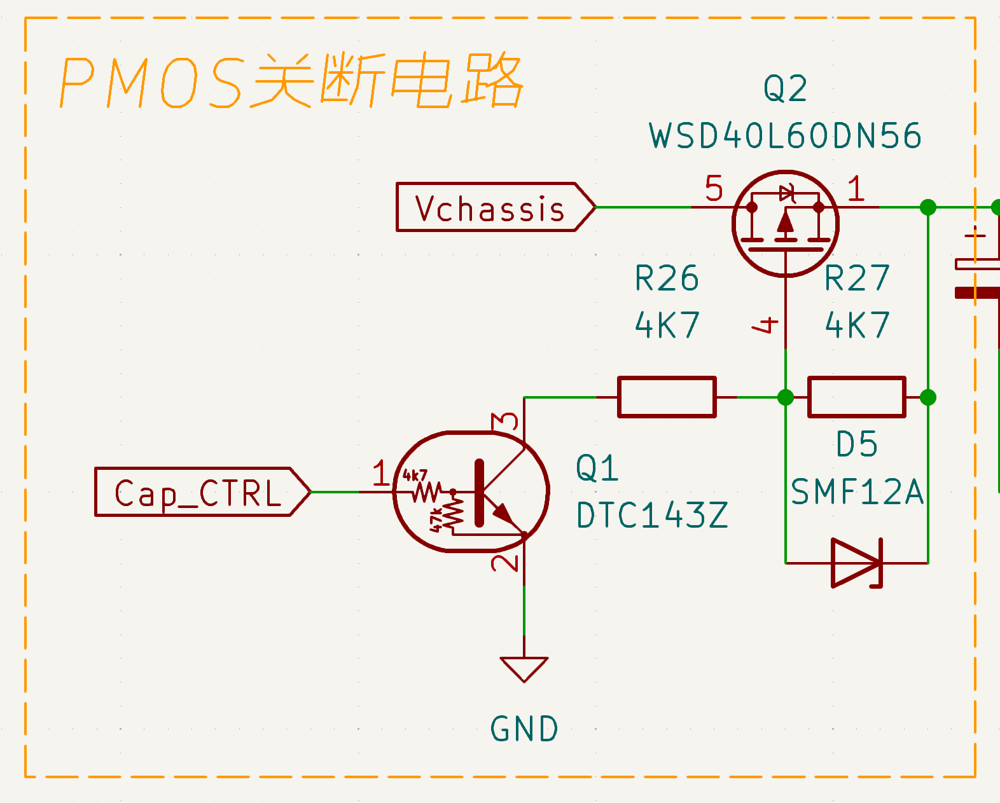

单个半桥的拓扑第二个麻烦的地方就是当母线电源关断之后，就算半桥MOS截止，电容组仍然会通过MOS的体二极管对母线进行供电，这需要一个额外的开关对其进行控制。本设计使用高边的PMOS作为这个电源开关，这个PMOS位于母线与开关半桥之间，其体二极管方向与半桥开关的NMOS体二极管方向相反，只需要这两个MOS同时截止就可以完全关断电容组与母线的连接。

使用PMOS作为高边开关相对于NMOS更容易驱动。由于PMOS的工艺普遍较差，相较于NMOS来说，相同的参数PMOS价格会更高，不过得益于其驱动条件相较于NMOS更容易，所以整体价格还是PMOS更低。在本设计中使用数字晶体管DTC143Z来驱动PMOS进行导通与截止，这是一种将三极管与基极电阻、下拉电阻集成的芯片，有助于精简外围电路。

选用WSD40L60DN56是因为当时这是我能找到的比较便宜、Rdson较低、且较容易购买到的一个型号（当然也可以白嫖样片）。这个PMOS的选型我认为只需要重点关注Rdson即可，因为它长时间处于导通状态，这个情况下最明显的就是Rdson产生的损耗。当然，如果它的导通与关断的时间较慢，且在此过程中通过较大的电流，则会导致烧毁，但是我在软件部分对其进行了优化，避免其在导通过程中有大电流经过。

## 电感

选用磁环电感最主要的原因是，在同规格的电感中，磁环电感这东西相对便宜而且非常好买。但是淘宝上的磁环电感商家对于磁环电感的饱和电流普遍是虚标的，自己计算的话请参考：《怎样计算磁环电感的饱和电流》🔗。
这里推荐一个在电脑上的小工具：实用电子工具箱🔗，可以计算磁环电感匝数。

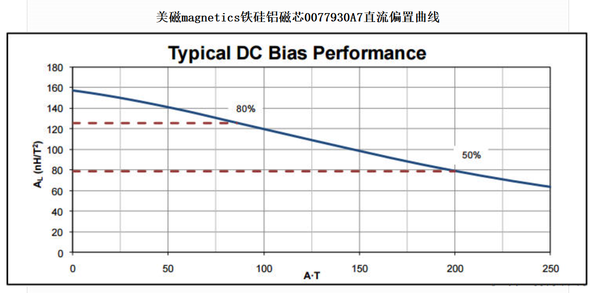

我使用的磁环是106-125磁环，磁环参考型号为77930A7🔗。我选用的电感值为22uH，淘宝买回来的磁环电感匝数是11匝左右，由上面的工具计算出来也是11匝左右，测量出来的空载感值也大约为22uH。磁环随着通过电流的大小，其电感系数近似线性地下降，11匝的电感在16A的情况下，A·T系数为176，此时电感系数已经衰减到差不多90nH/T^2。通过这些数据可以计算出此时的电感量为：11^2 * 90 / 1000 = 10.9uH。

通过输入电压24V，输出电压12V，开关频率100Khz，输出电流16A，电流纹波率40%这几个参数计算得出，需求的电感值为9.4uH左右，而我选用的电感此时电感量为10.9uH，可以满足此设计。
为什么输出电压选用12V？因为Buck拓扑通过公式可以的推导出，在半压输出的时候计算出来的电感量需求是最大的。  

> 这里推荐一个TI开发的一个电脑上的小工具：POWERSTAGE-DESIGNER🔗，内置许多电源拓扑的电路参数的计算，包括上一节的MOS损耗也可以粗略通过这个工具计算得出。

## 滤波电容

输入输出滤波电容为陶瓷电容与电解电容的组合，关于这部分我没有进行深入的考究，最终所呈现的纹波表现比较差。不过我尝试过换成固态电容进行测试，虽然纹波表现有了很好的改善，但是更换滤波电容对电源环路的影响非常严重。我使用电解电容调好的参数换成固态电容就会导致响应速度的下降，或许可以通过重新调节参数以适应不同的电路参数，对于这部分内容，我无法给予解释。
好像更换电感也会影响电源环路的参数。

## 电流检测

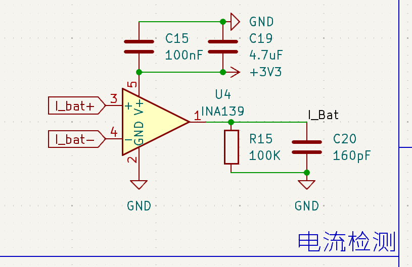

母线电流检测芯片使用INA139，这是一款低成本的单向高侧电流检测芯片。40V的耐压对于电池26V的电压有14V，50%的电压冗余，非常安全。

考虑到电源管理模块底盘端口额定电流为10A，最大电流30A持续500ms。一般情况下，电源管理模块输出的电流不超过5A，可以使用较大的采样电阻也不会有太大的功率损失。故采样电阻使用2mR搭配100倍的增益进行采样，由于INA139最大输出电压为VDD-0.7，在使用3.3V供电时最大输出为2.6V，不过我使用的ADC参考电压是2.5V，所以最大采样电流设置为12.5A。

> 这里建议修改一下增益，改为47倍左右，使电流量程超过25A，然后设定过流保护阈值为25A，保护时长500ms，能够极大程度地避免瞬时功率而导致超级电容模组Lite频繁触发过流保护（这里就根据个人喜好进行修改，我就不改硬件与代码了//懒）

**在测试中发现，由于Buck输入电流不连续的特性，在控制板Lite【电容】端口带载，【底盘】端口不带载；与【电容】端口不带载，【底盘】端口带载这两种情况。INA139的输出会有0.1V左右的差异，前者为小值，后者为大值。故，在对INA139的电池电流采样进行拟合时，需使用【底盘】端口进行测试才能确保设计精度。**

由于其是电流输出，手册给出的低通滤波器的设计是并联电容即可（并联的电阻是用于设置输出增益的），我这里选用的输出低通滤波器的截止频率为10Khz（其实INA139在100倍增益下的带宽也是差不多10Khz，稍后解释）。手册建议在接入ADC进行采样之前使用跟随器做缓冲，但是我实测发现没有太大的影响。

**使用26V耐压的INA181A2作为电容电流检测，是以为选用的21V电容组电压不至于导致芯片烧毁，但是没有考虑到接口开路，输入26V（电池满电）的情况，这种情况下，电容端口会有接近26V的电压，在上电时就有可能导致芯片烧毁。同时电容组的拔插产生的浪涌电压也会导致检流芯片烧毁（因为忘记给电容端口设置TVS了）。**

超级电容管理模块的最大电流为16A，但是其板上并不具备保护措施，这是一个可能会造成板载器件损坏的最大电流。在恒定功率输出的情况下，电容组的电压逐渐降低会使得电容组的输出电流上升，这个变化近似为线性变化。在电容组电压较低的时候，会产生很大的电流，为了能够监控到这个电流，需要有较大的量程。使用1mR采样电阻搭配50倍增益进行采样，由于是双向电流采样，使用1.65V作为INA181的偏置电压，故正向电流量程为0~17A，反向电流量程为0~33A。

**需要注意的是，INA181的偏置电压不能直接使用电阻分压，这会导致他在不同共模输入电压下产生不同的偏置电压。必须使用低阻抗的基准源提供，廉价的方案是电阻分压之后再使用跟随器进行阻抗变换。**

> 正常情况下，电流不太可能会达到30A，充电的时候会限制到8A进行恒流充电，而放电的时候，最高会控制其不超过17A放电电流，可以保证使用100W恒功率放电的时候能放到6V截止。
> 极限情况下，电控可能会使用200W进行放电，此时在7V就会接近30A，也会进行保护，虽然这个电流远超超级电容管理模块的承受极限。但是电容组200W从12V放到7V是一个非常短的时间（参考《7串3V60F1890J超级电容组测试报告》🔗），我觉得这一小段时间产生的热量不会导致电容管理模块损坏，不过这也大大提高了电容管理模块损坏的风险。

## 电压检测

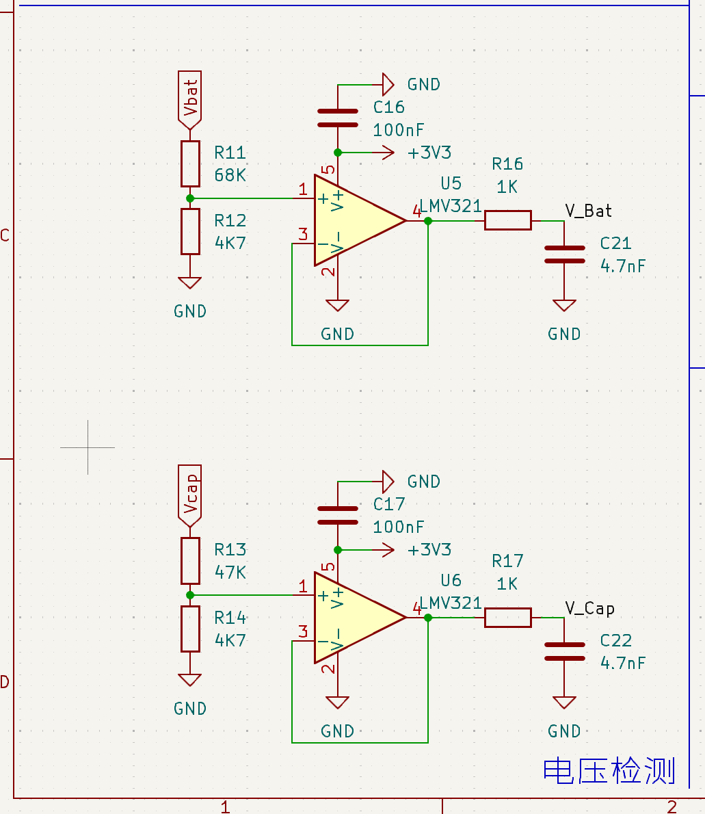

电压检测电路就是一个常规的电阻分压，经过跟随器阻抗变换后通过RC低通滤波器输入ADC进行采样，这里的低通滤波器截止频率也是
10Khz。

我在1.0的硬件版本中，发现内部运放做跟随器的线性度不太好之后，尝试过直接采分压电阻的电压，其实效果还是不错的。不过有一个问题是直接分压电阻和经过跟随器采样出来的拟合曲线斜率会有明显的不同，这可能是我没控制好分压电阻的阻抗导致的，但是其精度还是可以满足本设计的需求。

##模拟滤波器

ADC输入的RC滤波器，在G431的数据手册（所有STM32单片机手册都有）的第118页有对ADC相关内容的描述。由于单片机的ADC大多数是SAR-ADC，对于此类ADC，ADI有一系列相关视频：《【8节课】详解驱动SAR ADC，从模拟输入模型到具体电路应用》🔗

我对RC低通滤波器的电阻值选定是参考数据手册中121页表格61中给出的数据进行选择的，ADC的时钟我设置为了56.7Mhz，采样周期为24.5，使用的电阻为1K，电容为4.7nF，以尽量提高数据的可靠性和精度。

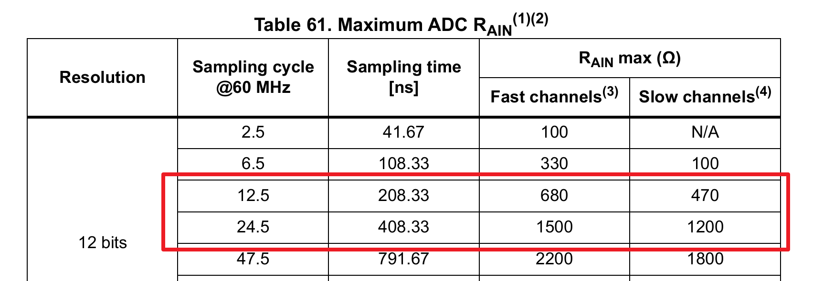

可以发现，我并没有使用图表上的电阻值，因为上面标的是最大电阻，并且我快速与慢速通道都有使用，所以我就以慢速通道为参考取了一个较小一点的的电阻值（快速通道与慢速通道用一样的值是因为我懒），然后把10Khz的截止频率带进去就可以算出来电容值。

低通滤波器设置为10Khz，这是我对 “**环路截止频率设置为开关频率1/10较为合适**” 的理解，这是业内普遍认可的一条规律。**不过我觉得，我这个理解似乎是错误的，目前我对电源环路的没有任何学习经验，同时也不具备测量电源环路bode图的条件。**

> 我看到的关于“环路截止频率设置为开关频率1/10较为合适”这句话的解释来自于知乎的《开关电源的控制环截止频率和开关频率有什么关系？》🔗这个话题。

就目前来说，我觉得只要把PI控制器的参数调的稍微好一点，只要保证速度够快，且不震荡，在RM就完全够用。至于电源环路的分析，对于我来说这颇有难度：一是缺乏理论知识的学习，二是缺乏相关测试设备（波特图仪）。

> 本项目从始至终并未进行过电源环路的分析，关于这方面的问题我无法进行解答。

## 辅助电源

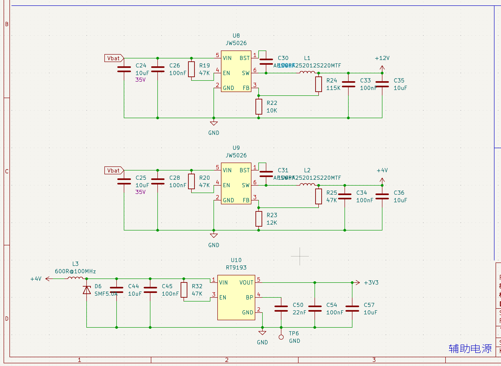

电源树是JW5026把24降10V给栅极驱动供电，24降4V再经过RT9193降3.3V给单片机供电。DCDC选用JW5026一个很重要的原因是他是一个FCCM的Buck芯片，可以保证在给单片机供电这种需求电流不大的场景保持连续导通，能有更好的纹波表现。JW5026的耐压为40V，对于电池26V的电压有14V，50%的电压冗余，非常安全。

驱动电源选用10V是因为较低的驱动电压能够稍微降低驱动损耗。

> 但是为什么不直接使用DCDC降到3.3V给单片机供电呢？因为我懒得分数字模拟供电，所以通过LDO获得一个较为干净的电源之后再给单片机的数字和模拟进行供电。

5V输出经过一个0805磁珠才进入RT9193，主要是因为JW5026的开关频率为1.1Mhz，在这个频率下常规的LDO的PSRR都比较低，所以需要使用别的手段将高频的开关噪声滤除再送入LDO比较好。而对于磁珠的选型，我没有做太多的考究，是选了一个在高频下有着较高阻抗的型号，效果还是有的，我也尝试过将其换成电感与后面的电容组成LC低通滤波器，不过没有进行详细的对比测试。

LDO选用RT9193是因为其价格比RT9013便宜，且PSRR参数更好。PSRR应该选用多好我没有深入研究，但是应该保证进入单片机的电源足够干净。由于本项目使用的是STM32内部基准作为参考电压，所以不太需要关注LDO的精度。
关于开关纹波如何进行滤除，请参考：《精密低噪声电源设计-理论篇》🔗

# 布局与走线

对于布线，很多情况下就只是连连看的程度就行。简单、快速、少换层、少打孔，以尽量短的路线去完成所有走线，这需要有良好的布局习惯。相同功能的电路放在一起，像单片机这种可以改变引脚功能的相关电路，需要多加尝试不同的组合就能做出较好的布局布线。

> 用过其他单片机的都说STM32的PINOUT不合理，不过好在电源领域所接触到的与STM32单片机相关的电路连接并不复杂，很多时候只需要不到十个引脚就可以完成相关的电路设计，布线基本没什么难度。

在进行元器件布局的时候，根据原理图划分的不同模块或者功能的电路相对独立开，观察他们之间的飞线连接，调整它们之间的位置关系，尽量减少飞线的交叉与长度，这就是一个良好布局的开始。在这个阶段，还可以灵活运用单片机引脚的复用功能调整连接关系（改软件可比改布局简单多了）。对元器件的布局有了大致的规划的时候，就可以对元器件的位置进行规整与走线了。我一般会使用0.25或0.5mm间距的网格，这样可以更好地让元器件进行对齐，使其更加美观。

由于这是一个电源板，需要在布局的同时规划好，或者优先考虑功率部分的电流回路与路径，给足相应的空间去安置这个巨大的噪声源才能保证电路的稳定运行。电源的布局布线尤为重要，当你能合理地进行电源的布局与走线的时候，常规的电路板的布局布线对你来说就没有什么难度了。

本项目采用双面板的设计，但是绝大多数贴片器件都在正面，背面基本都是直插器件（引脚伸到正面），设计上就是需要烙铁进行焊接的（我没有回流焊炉）。存在少量贴片元件，是连接器和两个贴片LED（其实想过用直插LED，但是那个位置的直插元器件有干涉）。

> 正面直接开钢网焊接，背面先焊贴片元器件，然后焊插件的时候，烙铁温度开高一点，以尽量短的时间去焊接插件电容和XT30。

## 电源

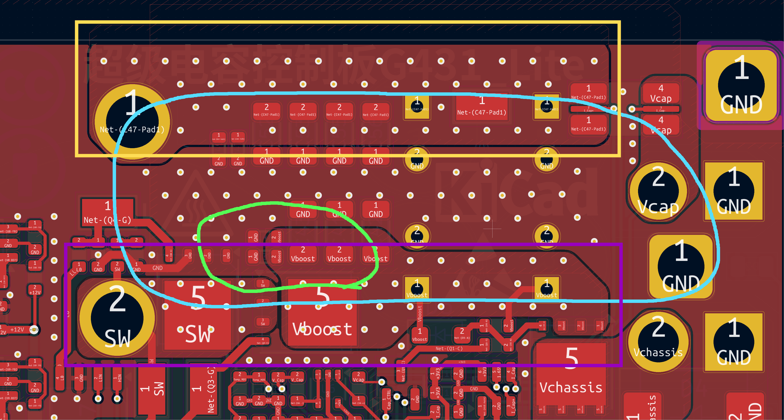

  在这个主功率回路里，我将输入输出电源回路控制在了蓝色圈内，热回路控制在了绿色圈内，其回流路径都比较短，应该能较好地减少对其他电路的干扰。
关于热回路的解释，请参考：《热回路究竟是什么？》🔗

关于热回路所产生的干扰，ADI进行了相关测试：《如何通过最小化热回路PCB ESR和ESL来优化开关电源布局》🔗  

电源布局不好所产生的干扰我没有条件进行测量与量化，但是有一些明显的噪声是可以被轻松测出来的，比如开关节点上的过冲尖峰及震荡，这可能会耦合进各个电源轨内，具体的表现是能在电源中测量出与开关频率相同的毛刺。
  橙色框是输出的铜箔，其需要承受峰值20A，平均8A左右的电流，虽然剩余的宽度只有6.5mm，但是我在每一层都铺了输出网络的铜箔，总厚度为1+0.5+0.5+1=3oz左右的铜箔，可以大大减少大电流的损耗。底下的紫色框则是输入的铜箔，此处铜箔平均电流大概为4A，峰值10A，虽然此处电流不是很大，但是由于其与MOS直接接触，需要大面积的铜箔用于MOS的散热。

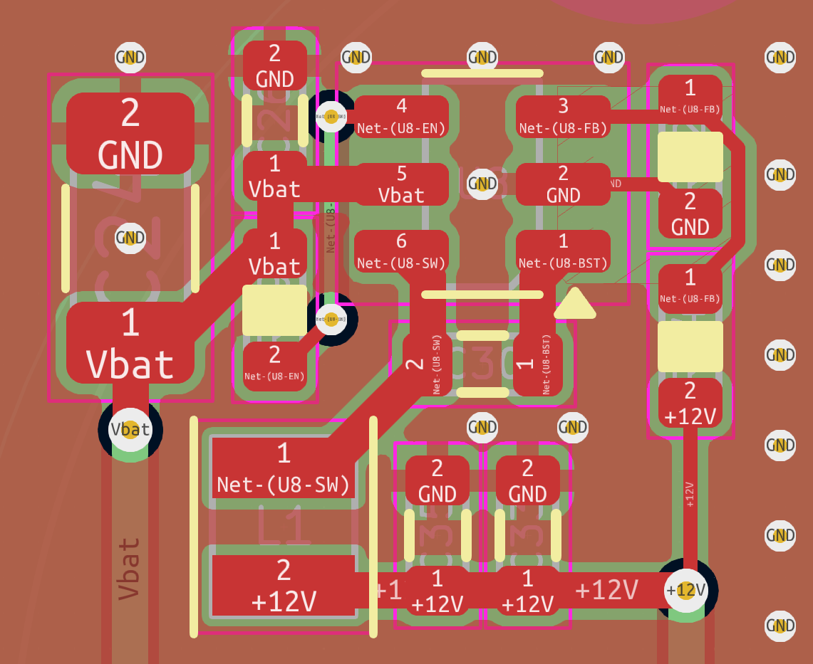

JW5026的布局用于提供参考，布局要点与上面一致。

> 像是TI、ADI、MPS等国际半导体大厂均在其芯片手册中详细写出了电源芯片的布局布线要点以及布局参考，广泛阅读各个厂家的数据手册就可以发现相似的电源芯片往往都有一个“标准”布局。
> 关于辅助电源的设计，请参考：《低压非隔离DCDC开关稳压器设计》🔗

## 模拟

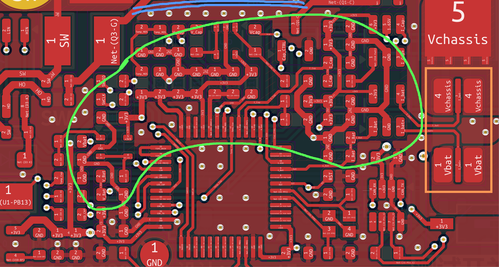

上图中绿色圈内是电压检测与电流检测相关的电路，这个范围内我设置了禁止地网络铺铜的区域，GND则手动进行走线，用了较粗的走线以减少长导线引起的对地平面的压差。并且相近的的地网络仅通过一个过孔与下方的地平面进行连接，我认为可以减少功率部分对模拟参考地平面的影响。

蓝色线段打了一排地网络过孔，希望他能像城墙一样抵挡上方功率电路对下方模拟电路的影响。（JW5026周围也有这样的设计，希望他有一点作用）

右侧的橙色方框是检流电阻，封装绘制成这个样子可以提高检流电阻的检测精度，详见：《改进低值分流电阻的焊盘布局，优化高电流检测精度》🔗

## 接地

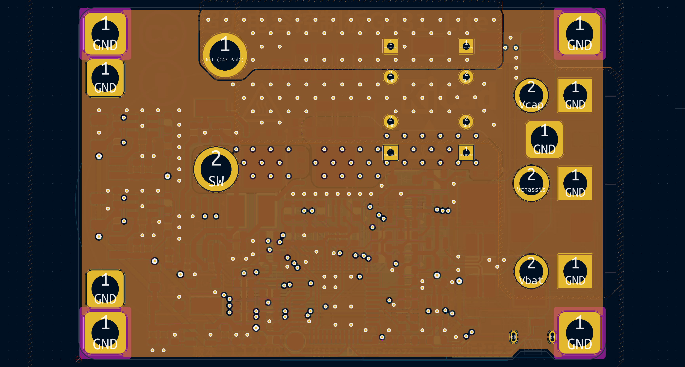

我将内2层作为完整的地平面，我认为可以起到两个作用：

- 作为屏蔽层吸收背面功率电感对正面电路的电磁干扰
- 提供一个各个地方均能够以打孔进行最短连接的参考平面

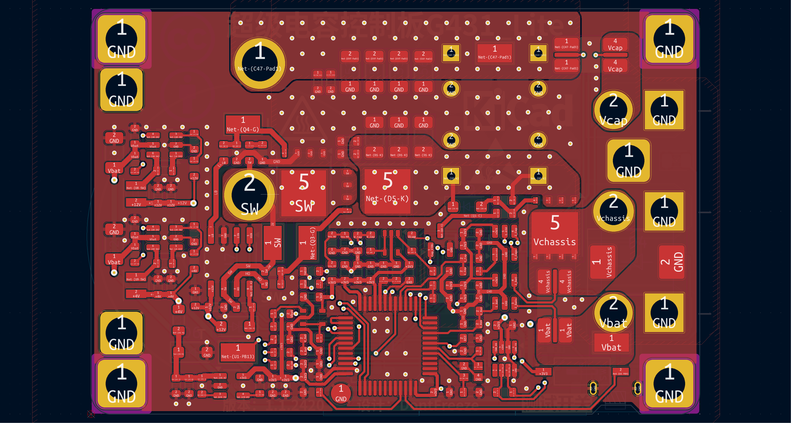

拥有一个完整地平面的好处在于，我在每个地方进行对地网络的过孔都可以是最短回流路径，所以我在每个芯片的接地引脚旁边，都放置了过孔。
接地相关的设计，请参考：《良好接地指导原则》🔗

# 外观与散热

> 可是固态电容真的好帅。

装配

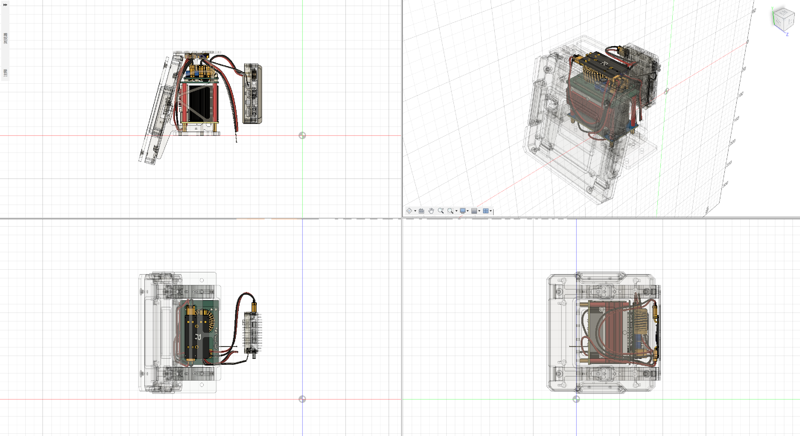

前段时间闲着无聊，叫机械给车子的模型给我搓了一下超级电容模块的走线图，此版本的超级电容模块（包括裁判系统的电源管理模块）完全可以塞到装甲板支架之间的位置，极大地利于机械对车子的体积进行优化。我认为这个体积已经没有必要再去缩减了（其实超级电容控制板应该做成和电容组一样的面积比较合适，不过我当时净想着做小了）

# 成本（2024年10月）

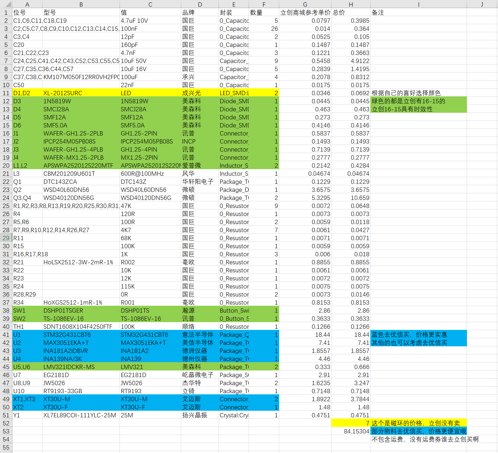
