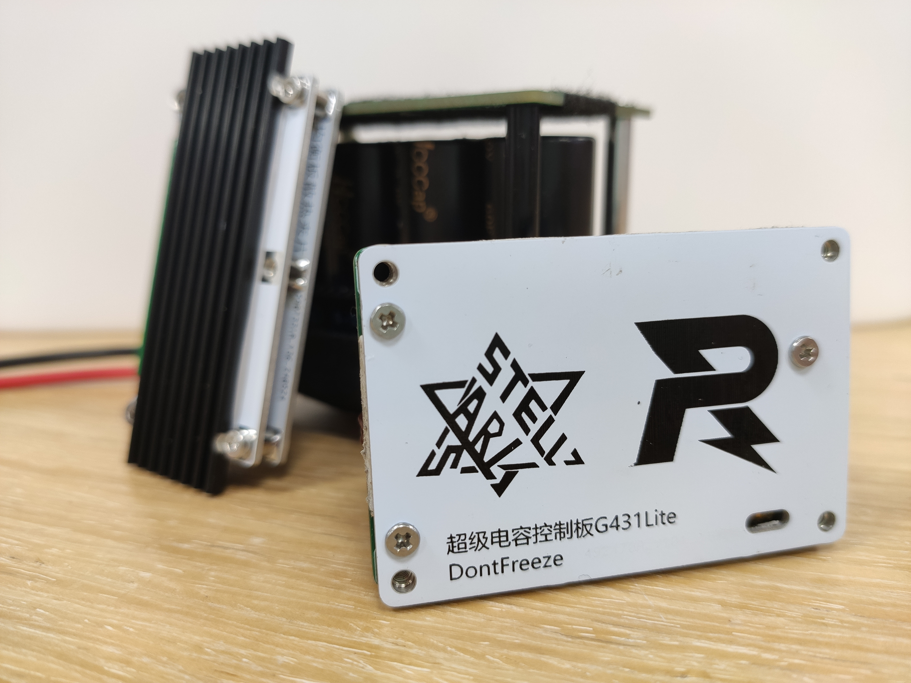

# 超级电容控制板 Lite



> 桂林理工大学 · 群星战队 · RoboMaster 2024 赛季开源工程

基于 **STM32G431CB** 的单半桥双向同步 Buck-Boost 超级电容控制板，用于 RoboMaster 机甲大师赛 2024 赛季高校联盟赛、超级对抗赛以及 2025 赛季高校联盟赛。Lite 版本在**保留上一代半桥功率拓扑**的前提下，对外围芯片重新选型，尽量精简外围电路，希望以较小的成本和体积实现较高的性能，并补充了半桥关键测试点与便于调试的板载资源。

> **完整的硬件设计说明** → [RM2024 超级电容控制板 Lite「硬件篇」 · DonotFreeze 的知识库](https://donotfreeze.github.io/robomaster/supercap-controller-lite-hardware/)

## 主要特性

- **单电感同步半桥**：PMOS 防倒灌 + 半桥 Buck/Boost，与半桥 NMOS 的体二极管方向相反，两者同时截止即可完全断开电容组与母线。
- **100 kHz 开关频率**：STM32G4 的 PWM 抖动模式可将分辨率提升至最高 20 位，100 kHz 下约 27200 个计数值可用（未开启时仅 1700），并使用内部 2.5 V 基准作为 ADC 参考，减小 LDO 精度对采样的影响。
- **完整的采样链路**：母线电流单向高边采样（INA139）、电容组电流双向采样（INA181A2 + 1.65 V 偏置）、母线/电容组电压电阻分压，均经 RC 10 kHz 低通滤波后送入 ADC。
- **温度监控**：半桥附近板载 NTC，电容组温度经 MX1.25 接口外接 NTC，为软件过温保护提供依据。
- **调试友好**：半桥关键测试点、复位/复用按键、拨码开关、两路状态指示灯、SWD 下载口。
- **小体积**：约 60 × 40 mm，配合电容组与裁判系统电源管理模块可塞入装甲板支架之间的位置。


## 硬件规格

| 项目 | 参数 |
| --- | --- |
| 主控 | STM32G431CBT6 |
| 拓扑 | 同步 Buck-Boost 半桥（降压充电 / 升压放电） |
| 开关频率 | 100 kHz（PWM 抖动模式） |
| 半桥 MOS | IRFH7440TRPBF × 2 |
| 防倒灌 PMOS | AGM60P100A |
| 栅极驱动 | EG2181 |
| 电感 | 106-125 磁环 11 匝 ≈ 22 µH（16 A 偏置下约 10.9 µH） |
| 母线电流采样 | 2 mΩ + INA139（单向，量程约 12.5 A） |
| 电容电流采样 | 1 mΩ + INA181A2（双向，+17 A / −33 A） |
| 电压采样 | 电阻分压 + LMV321 跟随器 |
| 温度采样 | 半桥 NTC + 外接电容组 NTC |
| 通信 | CAN |
| 辅助电源 | JW5026 × 2（24 V → 10 V / 4 V）+ RT9193（3.3 V） |
| 保护 | 母线 TVS、电容端口 TVS `SMCJ22A`、辅助电源输入自恢复保险丝 |
| 尺寸 | 约 60 × 40 mm × 1.6 mm |

## 工程结构

```text
├─ SuperCapPowerBoard_Lite.kicad_pro   # KiCad 8.0 工程文件
├─ SuperCapPowerBoard_Lite.kicad_sch   # 主控原理图
├─ SuperCapPowerBoard_Lite.kicad_pcb   # PCB 布局与走线
├─ POWER.kicad_sch                     # 功率级原理图
├─ bom/
│  └─ BOM_LITE_2610.html               # 交互式 BOM（点击可定位元件）
├─ GERBER/
│  └─ GERBER_LITE_2610.zip             # Gerber 与钻孔文件
├─ Images/                             # 文档配图
└─ CHANGELOG.md                        # 版本更新日志
```

## 固件代码

本仓库为**纯硬件工程**，不包含固件源码。固件由以下两个独立仓库提供，与本硬件配套使用：

| 仓库 | 说明 |
| --- | --- |
| [**RM-CODE-SuperCapControlBoard_Lite**](https://github.com/DonotFreeze/RM-CODE-SuperCapControlBoard_Lite) | RM2024 赛季超级电容控制板 Lite 的 **CubeMX 代码初始化工程**，提供 STM32 底层外设的 CubeMX 配置 |
| [**RM-SuperCapCtrlLib**](https://github.com/DonotFreeze/RM-SuperCapCtrlLib) | 参加 RoboMaster 机甲大师赛期间开发的 **C 语言库**，可同时用于超级电容控制板 **Lite 和 Plus**，负责充放电环路控制与对外接口 |

## 物料与打样

- BOM 见 `bom/BOM_LITE_2610.html`，Gerber 生产文件见 `GERBER/GERBER_LITE_2610.zip`，可直接送厂打样。
- **磁环电感需自行采购**：`106-125` 磁环（四线 1.0 mm 并绕 11 匝，初始感量约 22 µH）。
- 电容类元件耐压建议 ≥ 35 V；母线侧元件按电池满电 26 V 以上留足冗余。
- 成本参考 84 RMB/套（2024 年 10 月）。

## 参考资料

设计过程中参考的应用笔记与手册如下，完整的设计思路与参数推导见文首的「硬件篇」：

- 《RM0440 - STM32G4 系列参考手册》（PWM 抖动模式、ADC 相关章节）
- 《AN2834 - 如何在 STM32 微控制器中获得最佳 ADC 精度》
- 《AN5690 - 如何在 STM32 MCU 和 MPU 上使用 VREFBUF 外设》
- 《LAT1076 - STM32G4 Advanced Timer Break 功能详解》
- 《LAT1444 - ADC 采样中的阻抗匹配计算方法》
- 《MOSFET 驱动器与 MOSFET 的匹配设计》
- 《低压非隔离 DCDC 开关稳压器设计》
- 《精密低噪声电源设计 - 理论篇》
- 《热回路究竟是什么？》
- 《如何通过最小化热回路 PCB ESR 和 ESL 来优化开关电源布局》
- 《改进低值分流电阻的焊盘布局，优化高电流检测精度》

## 许可证

本作品采用 [CC-BY-4.0](LICENSE) 许可协议进行授权，欢迎转载，但请务必保留作者署名。

## 相关链接

- [RM2024 超级电容控制板 Lite「硬件篇」](https://donotfreeze.github.io/robomaster/supercap-controller-lite-hardware/)（本工程的设计说明）
- [固件代码 · RM-CODE-SuperCapControlBoard_Lite](https://github.com/DonotFreeze/RM-CODE-SuperCapControlBoard_Lite)（CubeMX 代码初始化工程）
- [固件代码 · RM-SuperCapCtrlLib](https://github.com/DonotFreeze/RM-SuperCapCtrlLib)（Lite / Plus 通用的 C 语言库）
- [RM2025 超级电容控制板 Plus「硬件篇」](https://donotfreeze.github.io/robomaster/supercap-controller-plus-hardware/)
- [RM2024 超级电容模组 Lite「使用手册」](https://donotfreeze.github.io/robomaster/supercap-module-lite-user-manual/)
- [RM24-25 超级电容控制板 Lite & Plus「CubeMX 篇」](https://donotfreeze.github.io/robomaster/supercap-controller-cubemx/)
- [RM24-25 超级电容控制板 Lite & Plus「软件篇」](https://donotfreeze.github.io/robomaster/supercap-controller-software/)
- [RM24-25 超级电容模组 Lite & Plus「维护手册」](https://donotfreeze.github.io/robomaster/supercap-module-maintenance-manual/)
- [RM24-25 超级电容模组 Lite & Plus「答疑篇」](https://donotfreeze.github.io/robomaster/supercap-module-faq/)
- [DonotFreeze 的知识库](https://donotfreeze.github.io/)